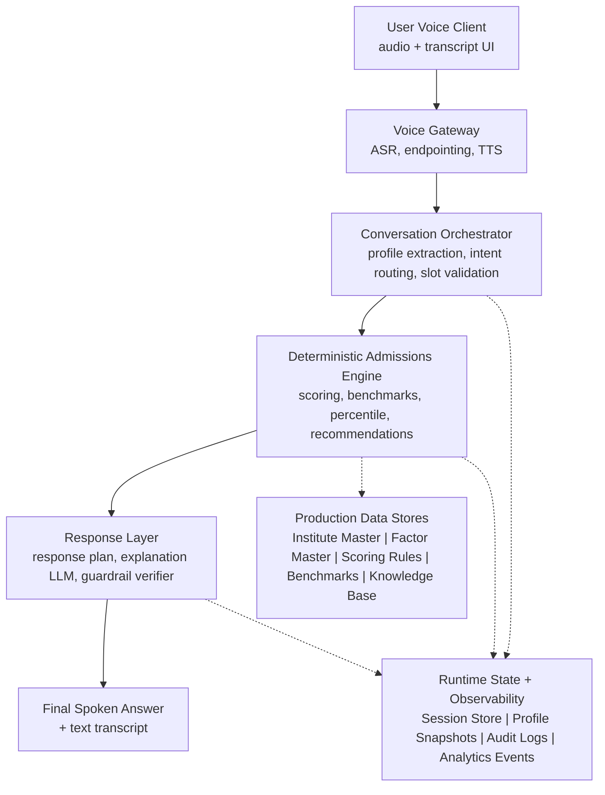
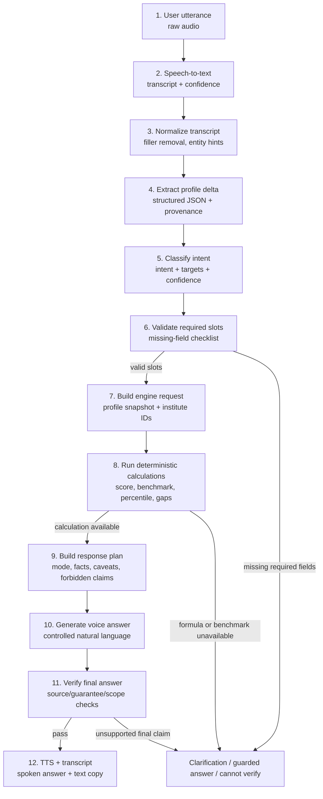
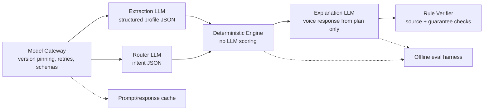
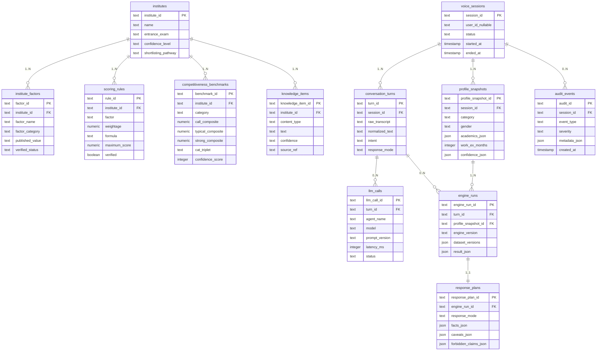
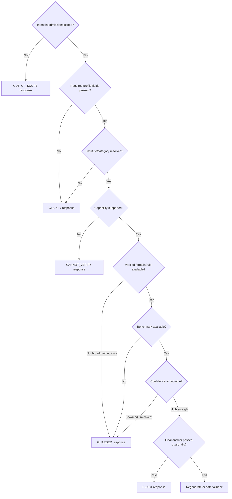
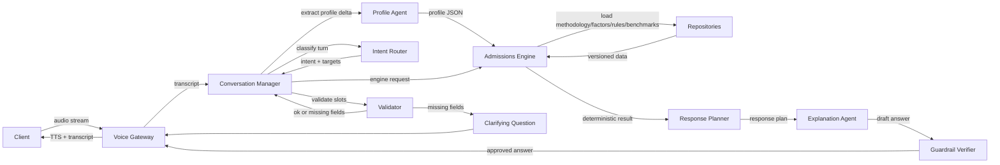

# Technical PRD / Engineering Design Specification

## AI Voice Admissions Assistant

Prepared for Clymber Engineering, AI, Product, and Architecture Teams  
2026-06-16

## Table of Contents

- [1 Document Control](#1-document-control)
  - [1.1 Purpose](#11-purpose)
  - [1.2 Technical North Star](#12-technical-north-star)
  - [1.3 Non-negotiable Engineering Rules](#13-non-negotiable-engineering-rules)
- [2 Production Data Landscape](#2-production-data-landscape)
  - [2.1 Dataset Inventory](#21-dataset-inventory)
  - [2.2 Dataset Shape Observed](#22-dataset-shape-observed)
- [3 Architecture Overview](#3-architecture-overview)
  - [3.1 Layer Responsibilities](#31-layer-responsibilities)
- [4 Component-Level Specification](#4-component-level-specification)
  - [4.1 1. Voice Input Gateway](#41-1-voice-input-gateway)
  - [4.2 2. Transcript Normalizer](#42-2-transcript-normalizer)
  - [4.3 3. Profile Extraction Agent](#43-3-profile-extraction-agent)
  - [4.4 4. Intent Router](#44-4-intent-router)
  - [4.5 5. Institute and Category Resolver](#45-5-institute-and-category-resolver)
  - [4.6 6. Profile Completeness Validator](#46-6-profile-completeness-validator)
  - [4.7 7. Capability Resolver](#47-7-capability-resolver)
  - [4.8 8. Admissions Logic Engine](#48-8-admissions-logic-engine)
  - [4.9 9. Benchmark and Percentile Engines](#49-9-benchmark-and-percentile-engines)
  - [4.10 10. Knowledge Retrieval Service](#410-10-knowledge-retrieval-service)
  - [4.11 11. Response Planner](#411-11-response-planner)
  - [4.12 12. Explanation Agent](#412-12-explanation-agent)
  - [4.13 13. Guardrail Verifier](#413-13-guardrail-verifier)
  - [4.14 14. Audit and Analytics Logger](#414-14-audit-and-analytics-logger)
- [5 End-to-End Data Flow](#5-end-to-end-data-flow)
  - [5.1 Runtime Flow](#51-runtime-flow)
  - [5.2 Data-flow Contract](#52-data-flow-contract)
- [6 Voice Agent Architecture](#6-voice-agent-architecture)
  - [6.1 Voice Components](#61-voice-components)
  - [6.2 Voice Latency Targets](#62-voice-latency-targets)
- [7 Conversation Management](#7-conversation-management)
  - [7.1 Conversation State Machine](#71-conversation-state-machine)
  - [7.2 Session State Object](#72-session-state-object)
  - [7.3 Slot-filling Rules](#73-slot-filling-rules)
  - [7.4 Profile Corrections](#74-profile-corrections)
  - [7.5 Follow-up Resolution](#75-follow-up-resolution)
- [8 Intent Classification Framework](#8-intent-classification-framework)
  - [8.1 Intent Taxonomy](#81-intent-taxonomy)
  - [8.2 Intent Classification Output Schema](#82-intent-classification-output-schema)
  - [8.3 Deterministic Routing Rules](#83-deterministic-routing-rules)
  - [8.4 Ambiguity Handling](#84-ambiguity-handling)
- [9 User Profile Schema](#9-user-profile-schema)
  - [9.1 Canonical Profile Schema](#91-canonical-profile-schema)
  - [9.2 Enumerations](#92-enumerations)
  - [9.3 Field Confidence Rules](#93-field-confidence-rules)
- [10 Deterministic Admissions Logic Engine](#10-deterministic-admissions-logic-engine)
  - [10.1 Engine Responsibilities](#101-engine-responsibilities)
  - [10.2 Engine Inputs](#102-engine-inputs)
  - [10.3 Engine Outputs](#103-engine-outputs)
  - [10.4 Capability Resolver](#104-capability-resolver)
  - [10.5 Engine Failure Modes](#105-engine-failure-modes)
- [11 Composite Score Calculation Framework](#11-composite-score-calculation-framework)
  - [11.1 Calculator Architecture](#111-calculator-architecture)
  - [11.2 Rule Loading](#112-rule-loading)
  - [11.3 Calculation Types](#113-calculation-types)
  - [11.4 Composite Calculation Pseudocode](#114-composite-calculation-pseudocode)
  - [11.5 Calculation Trace](#115-calculation-trace)
  - [11.6 Competitiveness Classification](#116-competitiveness-classification)
- [12 Percentile Estimation Framework](#12-percentile-estimation-framework)
  - [12.1 Required Percentile Flow](#121-required-percentile-flow)
  - [12.2 Target Levels](#122-target-levels)
  - [12.3 Calculation Contract](#123-calculation-contract)
  - [12.4 Mapping Strategies](#124-mapping-strategies)
  - [12.5 Percentile Output Rules](#125-percentile-output-rules)
  - [12.6 Non-CAT Exam Handling](#126-non-cat-exam-handling)
- [13 Knowledge Retrieval Layer](#13-knowledge-retrieval-layer)
  - [13.1 Retrieval Modes](#131-retrieval-modes)
  - [13.2 Retrieval Ranking](#132-retrieval-ranking)
  - [13.3 Knowledge Response Object](#133-knowledge-response-object)
  - [13.4 RAG Boundary](#134-rag-boundary)
- [14 LLM Orchestration Strategy](#14-llm-orchestration-strategy)
  - [14.1 LLM Roles](#141-llm-roles)
  - [14.2 Model Gateway](#142-model-gateway)
  - [14.3 LLM Determinism Controls](#143-llm-determinism-controls)
  - [14.4 Multi-LLM Strategy](#144-multi-llm-strategy)
- [15 Prompt Architecture](#15-prompt-architecture)
  - [15.1 Prompt Registry](#151-prompt-registry)
  - [15.2 Profile Extraction Prompt Contract](#152-profile-extraction-prompt-contract)
  - [15.3 Intent Router Prompt Contract](#153-intent-router-prompt-contract)
  - [15.4 Explanation Prompt Contract](#154-explanation-prompt-contract)
  - [15.5 Verifier Prompt Contract](#155-verifier-prompt-contract)
- [16 Session Memory Design](#16-session-memory-design)
  - [16.1 Memory Types](#161-memory-types)
  - [16.2 Memory Update Rules](#162-memory-update-rules)
  - [16.3 Profile Snapshot Hash](#163-profile-snapshot-hash)
- [17 Database Design](#17-database-design)
  - [17.1 Core Tables](#171-core-tables)
  - [17.2 Data Versioning](#172-data-versioning)
- [18 API Design](#18-api-design)
  - [18.1 API Principles](#181-api-principles)
  - [18.2 Voice Session APIs](#182-voice-session-apis)
  - [18.3 Deterministic Admissions APIs](#183-deterministic-admissions-apis)
  - [18.4 Admin and Data APIs](#184-admin-and-data-apis)
- [19 Response Planner](#19-response-planner)
  - [19.1 Response Modes](#191-response-modes)
  - [19.2 ResponsePlan Schema](#192-responseplan-schema)
  - [19.3 Voice Response Template Rules](#193-voice-response-template-rules)
- [20 Sequence Flow](#20-sequence-flow)
  - [20.1 Profile Evaluation Sequence](#201-profile-evaluation-sequence)
  - [20.2 Required Percentile Sequence](#202-required-percentile-sequence)
- [21 Safety and Guardrails](#21-safety-and-guardrails)
  - [21.1 Guardrail Categories](#211-guardrail-categories)
  - [21.2 Forbidden User-facing Claims](#212-forbidden-user-facing-claims)
  - [21.3 Allowed Safer Claims](#213-allowed-safer-claims)
  - [21.4 Guardrail Verifier Algorithm](#214-guardrail-verifier-algorithm)
  - [21.5 Out-of-scope Response Template](#215-out-of-scope-response-template)
- [22 Analytics and Monitoring](#22-analytics-and-monitoring)
  - [22.1 Core Metrics](#221-core-metrics)
  - [22.2 Event Taxonomy](#222-event-taxonomy)
  - [22.3 Audit Trace Requirements](#223-audit-trace-requirements)
  - [22.4 Monitoring Dashboards](#224-monitoring-dashboards)
  - [22.5 Alerting](#225-alerting)
- [23 Scalability Considerations](#23-scalability-considerations)
  - [23.1 Runtime Scaling](#231-runtime-scaling)
  - [23.2 Caching Strategy](#232-caching-strategy)
  - [23.3 Low-latency Design](#233-low-latency-design)
  - [23.4 Resilience](#234-resilience)
- [24 MVP Technical Scope](#24-mvp-technical-scope)
  - [24.1 MVP In Scope](#241-mvp-in-scope)
  - [24.2 MVP Out of Scope at Technical Level](#242-mvp-out-of-scope-at-technical-level)
  - [24.3 MVP Engineering Milestones](#243-mvp-engineering-milestones)
- [25 Engineering Test Strategy](#25-engineering-test-strategy)
  - [25.1 Unit Tests](#251-unit-tests)
  - [25.2 Golden Profiles](#252-golden-profiles)
  - [25.3 Regression Gates](#253-regression-gates)
- [26 Future Technical Roadmap](#26-future-technical-roadmap)
  - [26.1 Phase 2](#261-phase-2)
  - [26.2 Phase 3](#262-phase-3)
  - [26.3 Phase 4](#263-phase-4)
- [27 Appendix A - Component Checklist](#27-appendix-a---component-checklist)
- [28 Appendix B - Standard Error Codes](#28-appendix-b---standard-error-codes)
- [29 Appendix C - Response Examples as Engineering Fixtures](#29-appendix-c---response-examples-as-engineering-fixtures)
  - [29.1 Exact methodology answer fixture](#291-exact-methodology-answer-fixture)
  - [29.2 Missing profile fixture](#292-missing-profile-fixture)
  - [29.3 Out-of-scope fixture](#293-out-of-scope-fixture)
- [30 Appendix D - Implementation Recommendation](#30-appendix-d---implementation-recommendation)

## 1 Document Control

**Document type:** Technical Product Requirements Document / Engineering Design Specification  
**Product:** AI Voice Admissions Assistant  
**Source-of-truth input:** Product PRD for the AI Voice Admissions Assistant and finalized admissions intelligence datasets  
**Primary implementation principle:** deterministic admissions intelligence first, LLM-supported explanation second  
**Audience:** backend engineers, AI engineers, voice engineers, architects, product managers, QA, and analytics teams

### 1.1 Purpose

This document defines how the AI Voice Admissions Assistant should work technically. It translates the product requirements into system architecture, service boundaries, data contracts, runtime flows, deterministic calculation design, LLM orchestration, API contracts, storage design, safety mechanisms, monitoring, and MVP implementation scope.

This is not a rewrite of the Product PRD. The Product PRD defines user problems, product vision, and user-facing features. This document defines the engineering design needed to implement those requirements.

### 1.2 Technical North Star

The assistant must behave as a **deterministic admissions intelligence system with a voice-first conversational interface**.

The system must not be implemented as a free-form admissions chatbot. The runtime contract is:

    Structured production data + deterministic engines decide admissions logic.
    LLMs extract, clarify, explain, and make the interaction conversational.
    Voice services capture and speak the interaction.

### 1.3 Non-negotiable Engineering Rules

1.  **Admissions calculations are deterministic wherever structured rules exist.**
2.  **LLMs must not invent admission rules, formulas, benchmarks, or competitiveness labels.**
3.  **Composite score is the primary comparison variable; percentile is a derived estimate.**
4.  **Every output must distinguish verified methodology, benchmark estimate, derived percentile, and unavailable data.**
5.  **The assistant must ask clarifying questions before making profile-based recommendations when required fields are missing.**
6.  **The MVP must use current-session memory only unless a later release explicitly adds persistent user profiles.**
7.  **The system must fail closed: if data, methodology, or confidence is insufficient, return a guarded or cannot-verify answer instead of guessing.**

## 2 Production Data Landscape

The system already has finalized production datasets. Engineering should treat them as source-of-truth inputs and not redesign their contents during feature implementation.

### 2.1 Dataset Inventory

| Dataset                                           | Observed production role         | Key runtime usage                                                                                 |
|---------------------------------------------------|----------------------------------|---------------------------------------------------------------------------------------------------|
| `INSTITUTE_MASTER.csv`                            | Canonical institute registry     | Institute name resolution, entrance exam, shortlisting pathway, formula summary, confidence level |
| `FACTOR_MASTER.csv`                               | Institute-level factor inventory | Factor explainers, methodology answers, profile-gap attribution, factor metadata                  |
| `PROFILE_SCORING_ENGINE.csv`                      | Scoring-rule source              | Deterministic composite calculation where factor rules and weights exist                          |
| `mba_admissions_benchmark_reconstruction_v4.xlsx` | Competitiveness benchmark source | Institute-category benchmark comparison, CAT percentile bands, confidence explanations            |
| `CHATBOT_KNOWLEDGE_BASE.json`                     | Voice-ready explainer knowledge  | Methodology explainer, FAQ support, caveats, response grounding                                   |

### 2.2 Dataset Shape Observed

The implementation should preserve dataset provenance and versioning. Current shape:

| Dataset                | Row/object count                      | Important fields                                                                                                                                                  |
|------------------------|---------------------------------------|-------------------------------------------------------------------------------------------------------------------------------------------------------------------|
| Institute master       | 24 institutes                         | `Institute_Name`, `Institute_Type`, `Entrance_Exam`, `Admission_Cycle`, `Verification_Status`, `Confidence_Level`, `Shortlisting_Pathway`, `Shortlisting_Formula` |
| Factor master          | 86 factor rows                        | `Institute_Name`, `Factor_Name`, `Factor_Category`, `Published_Value`, `Published_Unit`, `Formula`, `Mandatory`, `Verification_Status`, `Source_Reference`        |
| Profile scoring engine | 50 scoring rows                       | `Institute_Name`, `Factor`, `Weightage`, `Unit`, `Formula`, `Minimum_Requirement`, `Maximum_Score`, `Verified`                                                    |
| Benchmark workbook     | 144 institute-category benchmark rows | `Institute`, `Category`, composite triplet, CAT triplet, `Confidence Score`, `Confidence Explanation`                                                             |
| Knowledge base         | 24 institute knowledge objects        | `Institute`, methodology, key factors, evaluation summaries, exceptions, formula summary, confidence                                                              |

The benchmark workbook contains these sheets:

| Sheet                       | Runtime relevance                                                              |
|-----------------------------|--------------------------------------------------------------------------------|
| `Final_Master_Table`        | Main production benchmark table for runtime decisions                          |
| `Composite_CAT_Calibration` | Calibration explanation for composite-to-CAT mapping and internal auditability |
| `Benchmark_Revisions`       | Revision trace; useful for governance, not required in hot path                |
| `Competitiveness_Audit`     | Competitiveness-tier explanation and benchmark review                          |
| `Source_References`         | Source lineage and external anchor references                                  |

Benchmark categories currently include:

    General, EWS, NC-OBC, SC, ST, PwD

## 3 Architecture Overview

The system is divided into five layers:

1.  **Voice Interaction Layer** - captures audio, transcribes, handles turn-taking, speaks the answer.
2.  **Conversation + LLM Layer** - normalizes transcript, extracts profile fields, routes intent, manages session state, generates natural language.
3.  **Deterministic Admissions Intelligence Layer** - resolves institutes, calculates scores, compares benchmarks, estimates percentile bands, classifies competitiveness.
4.  **Data + Retrieval Layer** - serves versioned structured datasets and knowledge-base entries.
5.  **Observability + Safety Layer** - logs traces, enforces guardrails, monitors quality and latency.

**System Architecture**

### 3.1 Layer Responsibilities

#### 3.1.1 Voice Interaction Layer

**Responsibilities**

- Accept microphone input from web or mobile client.
- Stream audio to ASR service.
- Detect speech end, silence, interruption, and retries.
- Return both spoken output and text transcript.
- Optionally support partial transcripts for low-latency interaction.

**Inputs**

- Raw audio stream.
- Session ID.
- Client metadata such as device type, language preference, and network quality.

**Outputs**

- ASR transcript.
- Transcript confidence.
- Audio response through TTS.
- Text version of final answer.

**Dependencies**

- ASR provider.
- TTS provider.
- Voice session store.
- Conversation manager.

**Failure handling**

- If ASR confidence is low, ask the user to repeat.
- If the transcript is incomplete, prompt for the missing detail rather than assuming.
- If TTS fails, return text response and retry TTS once.
- If streaming fails, fall back to single-turn audio upload if supported.

**Design considerations**

- Voice answers must be shorter than text answers by default.
- The system should support interruption and re-asking.
- The client should display the transcript so users can correct misunderstood profile details.

#### 3.1.2 Conversation + LLM Layer

**Responsibilities**

- Normalize transcripts.
- Extract candidate profile fields into structured JSON.
- Classify user intent.
- Resolve follow-up references such as “that college”, “BLACKI”, or “with my profile”.
- Decide whether the system needs clarification before deterministic evaluation.
- Convert deterministic response plans into voice-friendly answer text.

**Inputs**

- ASR transcript.
- Current session profile.
- Previous conversation turns.
- Supported intent taxonomy.
- Response plan from deterministic engine.

**Outputs**

- Structured profile delta.
- Intent classification object.
- Missing-field question.
- Voice response draft.

**Dependencies**

- LLM gateway.
- Prompt registry.
- Session memory.
- Institute alias resolver.
- Guardrail verifier.

**Failure handling**

- If extraction confidence is low, ask explicit confirmation.
- If intent confidence is low, classify as `CLARIFICATION` and ask a narrow question.
- If the LLM returns invalid JSON, retry once with repair prompt; if still invalid, fall back to deterministic clarification.

**Design considerations**

- LLM outputs must use strict JSON schemas for extraction and routing.
- The explanation agent must receive a response plan, not raw datasets.
- The explanation agent must not add new admissions facts beyond the response plan.

#### 3.1.3 Deterministic Admissions Intelligence Layer

**Responsibilities**

- Resolve target institutes and institute groups.
- Resolve category and exam pathway.
- Determine whether the requested capability is supported for each institute.
- Calculate profile score and factor contributions where scoring rules exist.
- Compare composite score to institute-category benchmarks.
- Estimate required CAT percentile bands from composite gaps.
- Rank target colleges into competitiveness buckets.
- Generate reason codes and caveats.

**Inputs**

- Normalized profile snapshot.
- Intent object.
- Institute IDs.
- Category.
- Current or target exam score, if available.
- Dataset versions.

**Outputs**

- Engine result object.
- Composite score breakdown.
- Benchmark comparison.
- Required percentile estimate.
- Competitiveness label.
- Reason codes.
- Response mode recommendation.

**Dependencies**

- Institute repository.
- Factor repository.
- Scoring rule repository.
- Benchmark repository.
- Capability resolver.
- Audit logger.

**Failure handling**

- If a scoring rule is unavailable, return `CALCULATION_UNAVAILABLE` for that factor.
- If benchmark row is missing, return `BENCHMARK_UNAVAILABLE` and avoid percentile claims.
- If inputs are invalid or impossible, return typed validation errors.
- If institute confidence is low, downgrade answer mode from exact to guarded.

**Design considerations**

- The engine should be pure and side-effect-free except for audit logging.
- Given the same profile, institute, category, dataset version, and engine version, the engine must return the same decision object.
- Calculators should be modular by calculation type.

#### 3.1.4 Data + Retrieval Layer

**Responsibilities**

- Load production datasets into normalized tables or cached read models.
- Maintain dataset version identifiers.
- Serve exact institute/factor lookups.
- Serve benchmark triplets by institute-category.
- Serve knowledge-base entries for methodology explainers and FAQs.
- Provide source and confidence metadata to response planning.

**Inputs**

- Dataset files or imported database records.
- Query objects from repositories.
- Dataset version selection.

**Outputs**

- Institute metadata.
- Factor metadata.
- Scoring rules.
- Benchmark rows.
- Knowledge items.

**Dependencies**

- Relational database.
- Optional vector/keyword index for FAQ and methodology retrieval.
- Data import pipeline.

**Failure handling**

- If the selected dataset version is unavailable, block deployment or fall back to last approved version.
- If source data has schema mismatch, fail ingestion before runtime.
- Runtime should not silently use partial datasets.

**Design considerations**

- Structured lookup must be preferred over semantic retrieval.
- RAG should be limited to explanation and FAQ contexts, not scoring decisions.
- Dataset row IDs should be stable across imports where possible.

#### 3.1.5 Observability + Safety Layer

**Responsibilities**

- Capture every turn, engine decision, model call, guardrail event, and latency metric.
- Store reproducible audit traces.
- Enforce scope, source, guarantee, and confidence guardrails.
- Monitor drift, fallback rates, and user friction.

**Inputs**

- Conversation events.
- Engine traces.
- LLM call metadata.
- Guardrail decisions.
- User feedback signals.

**Outputs**

- Analytics events.
- Audit logs.
- Alerts.
- Evaluation reports.

**Dependencies**

- Logging pipeline.
- Metrics store.
- Trace collector.
- Dashboarding tool.

**Failure handling**

- If analytics logging fails, do not block the user response unless audit logging is required for compliance.
- If guardrail verification fails, block or regenerate the response.
- If critical telemetry is unavailable for an engine run, mark the response as non-auditable and log a severity event.

**Design considerations**

- Admissions advice should be fully traceable.
- Logs must avoid storing raw sensitive fields unnecessarily; use profile hashes where possible.
- Analytics and audit logs should be separated from production user-facing state.

## 4 Component-Level Specification

This section gives implementation-level contracts for the main runtime components. Each component should have an owner, unit tests, integration tests, timeout budget, and trace events before MVP launch.

### 4.1 1. Voice Input Gateway

**Responsibilities**

- Accept audio from client.
- Stream to ASR provider.
- Package transcript events for conversation manager.
- Route approved answer text to TTS.

**Inputs**

- Audio frames, session ID, client metadata, language code.

**Outputs**

- Partial transcript, final transcript, TTS audio stream, voice error events.

**Dependencies**

- ASR provider, TTS provider, conversation orchestrator, session store.

**Failure handling**

- Low ASR confidence -\> ask repeat or show editable transcript.
- ASR timeout -\> allow typed fallback.
- TTS failure -\> return text answer and retry voice once.

**Design considerations**

- Avoid starting admissions calculation on partial transcripts.
- Preserve final transcript for audit and user correction.

### 4.2 2. Transcript Normalizer

**Responsibilities**

- Clean filler words and ASR artifacts.
- Normalize common spoken forms: “IIM A” -\> possible `iim_ahmedabad`, “OBC” -\> `NC-OBC` candidate until confirmed.
- Preserve raw transcript separately.

**Inputs**

- Final transcript, ASR confidence, language metadata.

**Outputs**

- Normalized text, entity hints, low-confidence spans.

**Dependencies**

- Alias dictionary, category dictionary, institute group dictionary.

**Failure handling**

- If normalization creates ambiguity, pass candidate matches to institute resolver instead of choosing silently.

**Design considerations**

- The raw transcript must remain immutable.
- Normalization should not change numerical values unless the user confirms.

### 4.3 3. Profile Extraction Agent

**Responsibilities**

- Extract candidate profile fields from natural speech.
- Detect corrections and what-if scenarios.
- Return schema-valid `ProfileDelta`.

**Inputs**

- Normalized transcript, current profile snapshot, pending clarification state.

**Outputs**

- Profile delta, low-confidence fields, correction events.

**Dependencies**

- LLM gateway, profile schema, category/gender/academic-background enums.

**Failure handling**

- Invalid JSON -\> retry once with same transcript and stricter repair prompt.
- Low confidence -\> ask confirmation before using field in deterministic calculation.

**Design considerations**

- It must not produce admissions recommendations.
- It must not convert CGPA to percentage unless a deterministic conversion rule exists.

### 4.4 4. Intent Router

**Responsibilities**

- Classify the user’s admissions intent.
- Identify target institutes/groups and factor focus.
- Mark out-of-scope requests.

**Inputs**

- Normalized transcript, session context, previous intent, target context.

**Outputs**

- `IntentClassification` object.

**Dependencies**

- Rule-based patterns, optional LLM router, institute resolver.

**Failure handling**

- Ambiguous intent -\> ask clarification.
- Conflicting intent and context -\> prefer clarification over assumption.

**Design considerations**

- Rule-first for obvious phrases.
- LLM-assisted for indirect user phrasing.

### 4.5 5. Institute and Category Resolver

**Responsibilities**

- Resolve institute names, aliases, and groups.
- Normalize categories to benchmark-supported categories.
- Expand groups like BLACKI into canonical institute IDs.

**Inputs**

- Target strings, user category string, session target context.

**Outputs**

- Canonical institute IDs, category enum, ambiguity list.

**Dependencies**

- Institute master, alias table, group mapping table, benchmark category list.

**Failure handling**

- Unknown institute -\> ask user to choose from likely matches.
- Unsupported category -\> ask correction.

**Design considerations**

- User-facing names should remain human-readable; internal logic must use IDs.

### 4.6 6. Profile Completeness Validator

**Responsibilities**

- Determine whether enough fields exist for the requested intent.
- Generate the next clarifying question.
- Avoid unnecessary field collection for methodology-only questions.

**Inputs**

- Intent classification, profile snapshot, target institutes, capability map.

**Outputs**

- `can_answer`, missing fields, clarification prompt, validation errors.

**Dependencies**

- Intent requirements config, profile schema, institute-specific requirements.

**Failure handling**

- If too many fields are missing, ask for the smallest useful group of fields.

**Design considerations**

- Voice prompts should ask for no more than three to seven fields at once depending on the interaction stage.

### 4.7 7. Capability Resolver

**Responsibilities**

- Determine whether each institute supports exact calculation, guarded explanation, or cannot-verify response.
- Prevent unsupported scoring and percentile estimation.

**Inputs**

- Institute ID, intent, available scoring rules, benchmark availability, knowledge confidence.

**Outputs**

- Capability list, unsupported list, reason code.

**Dependencies**

- Institute master, scoring repository, benchmark repository, KB repository.

**Failure handling**

- Missing capability -\> downgrade answer mode.

**Design considerations**

- Capability gating must happen before explanation generation.

### 4.8 8. Admissions Logic Engine

**Responsibilities**

- Execute deterministic scoring and comparison logic.
- Produce reason codes, trace, and response-mode recommendation.

**Inputs**

- Engine request, profile snapshot, target institutes, category, dataset versions.

**Outputs**

- Engine result, calculation trace, errors or caveats.

**Dependencies**

- Scoring rules, factors, benchmarks, institute metadata.

**Failure handling**

- Missing calculation input -\> return typed clarification need.
- Rule unavailable -\> return guarded/no-calculation result.
- Unexpected exception -\> safe fallback and severity log.

**Design considerations**

- Should be pure and deterministic.
- Should be independently testable without LLMs or voice services.

### 4.9 9. Benchmark and Percentile Engines

**Responsibilities**

- Fetch institute-category composite and CAT benchmark triplets.
- Classify competitiveness.
- Estimate percentile bands from composite gap.

**Inputs**

- Composite score, non-CAT contribution, target benchmark level, category.

**Outputs**

- Benchmark gaps, competitiveness label, percentile range, confidence.

**Dependencies**

- Benchmark repository, CAT mapping strategy, scoring engine output.

**Failure handling**

- No benchmark row -\> no percentile estimate.
- Out-of-range calculation -\> return `ABOVE_MODEL_RANGE` or guarded response.

**Design considerations**

- Composite benchmark is treated as more reliable than CAT percentile estimate.

### 4.10 10. Knowledge Retrieval Service

**Responsibilities**

- Serve method, factor, formula, caveat, and FAQ evidence from production data.
- Rank retrieval deterministically.

**Inputs**

- Institute ID, factor focus, question type, confidence threshold.

**Outputs**

- Knowledge items, confidence labels, caveats, unsupported-claim indicators.

**Dependencies**

- KB table, factor master, institute master, optional search index.

**Failure handling**

- No item found -\> cannot-verify response or ask institute-specific clarification.

**Design considerations**

- Exact structured lookup should beat semantic search.

### 4.11 11. Response Planner

**Responsibilities**

- Convert engine/KB outputs into a constrained response plan.
- Decide exact, guarded, cannot-verify, clarify, or out-of-scope mode.
- Attach required caveats and forbidden claims.

**Inputs**

- Engine result, knowledge result, validation result, intent.

**Outputs**

- Response plan object.

**Dependencies**

- Response templates, guardrail policy, confidence policy.

**Failure handling**

- If facts are insufficient, produce cannot-verify response plan instead of calling explanation LLM with weak context.

**Design considerations**

- The response plan is the final source of truth for the explanation LLM.

### 4.12 12. Explanation Agent

**Responsibilities**

- Turn response plan into concise spoken language.
- Preserve caveats, confidence, and response mode.

**Inputs**

- Response plan only.

**Outputs**

- Draft assistant response text.

**Dependencies**

- LLM gateway, prompt registry, response style rules.

**Failure handling**

- LLM failure -\> template-based response.
- Overlong answer -\> compression pass or deterministic truncation.

**Design considerations**

- It must not add facts not present in the plan.

### 4.13 13. Guardrail Verifier

**Responsibilities**

- Check final answer before delivery.
- Enforce no unsupported claims, no guarantees, no scope drift, and caveat preservation.

**Inputs**

- Draft answer, response plan, guardrail policy.

**Outputs**

- Approved final answer or blocked response with failure reasons.

**Dependencies**

- Rule-based phrase checks, numeric claim extractor, optional verifier LLM.

**Failure handling**

- Blocked answer -\> regenerate once; if still blocked, use deterministic safe fallback.

**Design considerations**

- Rule-based checks should be mandatory even if an LLM verifier is added.

### 4.14 14. Audit and Analytics Logger

**Responsibilities**

- Record full reproducibility trace.
- Emit analytics events.
- Support debugging, QA, and product improvement.

**Inputs**

- Transcript events, profile deltas, intent, engine run, LLM calls, final answer, user feedback.

**Outputs**

- Audit events, analytics events, latency metrics.

**Dependencies**

- Database, metrics system, event queue.

**Failure handling**

- Non-critical analytics failure should not block response.
- Critical audit failure should mark response as non-auditable and raise alert.

**Design considerations**

- Redact or hash sensitive profile values where full storage is not necessary.

## 5 End-to-End Data Flow

**End-to-End Data Flow**

### 5.1 Runtime Flow

1.  User speaks a question.
2.  Voice gateway transcribes audio.
3.  Transcript normalizer cleans filler words and standardizes text.
4.  Profile extraction agent extracts structured profile fields.
5.  Conversation manager merges the profile delta into current-session profile memory.
6.  Intent router classifies the user request.
7.  Institute resolver maps user phrases to canonical institute IDs or groups.
8.  Profile completeness validator checks whether the intent can be answered.
9.  Deterministic engine executes the relevant calculation or lookup.
10. Response planner chooses exact, guarded, cannot-verify, clarification, or out-of-scope mode.
11. Explanation LLM converts the response plan into concise voice text.
12. Guardrail verifier checks the final answer.
13. Voice gateway speaks the response and stores the transcript.
14. Audit logger records inputs, dataset versions, engine result, response mode, and guardrail status.

### 5.2 Data-flow Contract

The system should not pass free-form text between internal layers when structured objects are available. The recommended handoff objects are:

| Stage                                | Handoff object           |
|--------------------------------------|--------------------------|
| ASR to conversation manager          | `TranscriptEvent`        |
| Profile extraction to session memory | `ProfileDelta`           |
| Intent routing to validator          | `IntentClassification`   |
| Validator to engine                  | `EngineRequest`          |
| Engine to response planner           | `AdmissionsEngineResult` |
| Planner to explanation LLM           | `ResponsePlan`           |
| Explanation LLM to verifier          | `DraftAnswer`            |
| Verifier to voice gateway            | `FinalAnswer`            |

## 6 Voice Agent Architecture

The voice agent should be implemented as a thin real-time wrapper over the deterministic admissions system.

### 6.1 Voice Components

#### 6.1.1 Voice Client

**Responsibilities**

- Capture microphone input.
- Show live or final transcript.
- Show spoken answer as text.
- Allow correction of extracted profile fields.
- Handle session start/end.

**Inputs**

- User audio.
- User tap/click state.
- Optional typed corrections.

**Outputs**

- Audio stream.
- Transcript correction events.
- Session lifecycle events.

**Failure handling**

- If microphone access fails, provide text input fallback.
- If network is unstable, pause recording and show retry UI.

#### 6.1.2 Voice Gateway

**Responsibilities**

- Terminate WebSocket or streaming connection.
- Send audio to ASR.
- Receive and normalize ASR events.
- Send final text to TTS.
- Stream audio answer back to client.

**Inputs**

- Audio frames.
- Session ID.
- Language and voice settings.

**Outputs**

- Transcript events.
- Audio response stream.
- Voice latency metrics.

**Dependencies**

- ASR provider.
- TTS provider.
- Conversation manager API.

**Failure handling**

- Retry transient ASR/TTS failures once.
- Fall back to text response if TTS is unavailable.
- Mark turn as `VOICE_DEGRADED` in logs.

#### 6.1.3 Turn-taking Manager

**Responsibilities**

- Decide when a user turn is complete.
- Avoid starting final reasoning on partial profile statements.
- Support barge-in if the user interrupts the answer.
- Handle repeat and correction commands.

**Design considerations**

- Admissions profile inputs often contain numbers; endpointing should allow short pauses between values.
- The UI should display extracted profile fields after important turns because ASR errors in numbers can materially change results.

### 6.2 Voice Latency Targets

| Segment                             | MVP target                   | Notes                                |
|-------------------------------------|------------------------------|--------------------------------------|
| ASR final transcript                | 1.0-2.0 sec after user stops | Depends on provider and endpointing  |
| Profile extraction + intent routing | 0.5-1.5 sec                  | Use fast model with strict JSON      |
| Deterministic engine                | \<300 ms                     | Data should be cached/in-memory      |
| Explanation generation              | 1.0-2.5 sec                  | Use concise response plan            |
| TTS start                           | \<1.0 sec after final text   | Use streaming TTS if available       |
| Total perceived response            | 3-7 sec                      | Clarification turns should be faster |

The MVP should prioritize correctness over ultra-low latency. For deterministic decisions, it is better to take an extra second than to produce unsupported admissions guidance.

## 7 Conversation Management

Conversation management coordinates multi-turn slot filling, session profile state, corrections, and follow-up references.

### 7.1 Conversation State Machine

    START
      -> LISTENING
      -> TRANSCRIBED
      -> PROFILE_EXTRACTION
      -> INTENT_ROUTING
      -> SLOT_VALIDATION
      -> CLARIFYING | ENGINE_EXECUTION | OUT_OF_SCOPE
      -> RESPONSE_PLANNING
      -> EXPLANATION_GENERATION
      -> VERIFICATION
      -> SPEAKING
      -> LISTENING

### 7.2 Session State Object

    {
      "session_id": "sess_123",
      "status": "active",
      "profile_snapshot_id": "prof_456",
      "profile_completeness": {
        "basic_identity": true,
        "academics": true,
        "work_experience": true,
        "exam_score": false
      },
      "last_intent": "PROFILE_EVALUATION",
      "last_target_institutes": ["iim_ahmedabad", "iim_bangalore"],
      "last_response_mode": "GUARDED",
      "open_clarification": {
        "missing_fields": ["category", "graduation_stream"],
        "asked_at_turn_id": "turn_008"
      }
    }

### 7.3 Slot-filling Rules

| Intent                | Required fields before answer                                                             | If missing                                                                   |
|-----------------------|-------------------------------------------------------------------------------------------|------------------------------------------------------------------------------|
| Methodology explainer | Institute                                                                                 | Ask institute name if absent                                                 |
| Admissions FAQ        | Question text; optional institute                                                         | Answer general only if allowed; ask institute if answer depends on institute |
| Profile evaluation    | Category, gender, 10th, 12th, graduation, stream, work experience, target institute/group | Ask for only missing high-impact fields                                      |
| Required percentile   | Profile fields, category, target institute/group, target level                            | Ask for profile and target institute                                         |
| Gap analysis          | Profile fields and target institute/group                                                 | Ask target institute/group if not available from context                     |
| Target recommendation | Profile fields and expected/current percentile or target score if required                | Ask for profile and current/target percentile                                |
| Institute comparison  | Two or more institutes; optional factor                                                   | Ask for missing institute or comparison factor                               |

### 7.4 Profile Corrections

The system must support corrections such as:

    Actually my graduation is 7.8, not 8.7.
    I am OBC, not general.
    I meant IIM Calcutta, not Kozhikode.

Correction handling:

1.  Extract corrected field.
2.  Update current profile snapshot.
3.  Mark previous field value as superseded.
4.  Re-run deterministic calculation if the corrected field affects the last answer.
5.  Tell the user that the estimate changed because the profile field changed.

### 7.5 Follow-up Resolution

Examples:

| User follow-up             | Resolver behavior                                                                                 |
|----------------------------|---------------------------------------------------------------------------------------------------|
| “What about Bangalore?”    | Use previous profile, switch target institute to IIM Bangalore                                    |
| “And for OBC?”             | Create temporary what-if category scenario; do not overwrite actual category unless user confirms |
| “Which one is safest?”     | Use last institute group and previous engine results                                              |
| “Why is Ahmedabad harder?” | Use comparison between last result and IIM Ahmedabad methodology/benchmark                        |

## 8 Intent Classification Framework

Intent classification determines the deterministic route. It should be rule-first for obvious patterns and LLM-assisted for ambiguous conversational phrasing.

### 8.1 Intent Taxonomy

| Intent                            | Description                                                           | Deterministic route                              |
|-----------------------------------|-----------------------------------------------------------------------|--------------------------------------------------|
| `PROFILE_EVALUATION`              | User asks whether profile is strong enough                            | Profile scoring + benchmark comparison           |
| `REQUIRED_PERCENTILE`             | User asks what percentile or score to target                          | Required CAT contribution + percentile estimator |
| `INSTITUTE_METHODOLOGY_EXPLAINER` | User asks how a school shortlists/evaluates                           | Knowledge/institute/factor lookup                |
| `PROFILE_GAP_ANALYSIS`            | User asks what is hurting/helping profile                             | Factor contribution and gap engine               |
| `TARGET_COLLEGE_RECOMMENDATION`   | User asks which colleges to target                                    | Multi-institute ranking engine                   |
| `INSTITUTE_COMPARISON`            | User compares schools or factors                                      | Comparative methodology + benchmark engine       |
| `ADMISSIONS_FAQ`                  | User asks generic admissions question in scope                        | Knowledge retrieval + guarded response           |
| `CLARIFICATION`                   | User answers previous missing-field prompt                            | Merge profile delta and resume pending route     |
| `OUT_OF_SCOPE`                    | CAT tutoring, resume review, career counseling, current affairs, etc. | Refuse or redirect to admissions scope           |

### 8.2 Intent Classification Output Schema

    {
      "intent": "REQUIRED_PERCENTILE",
      "intent_confidence": 0.94,
      "requires_profile": true,
      "target_institutes": ["iim_ahmedabad"],
      "target_group": null,
      "target_level": "CALL_THRESHOLD",
      "factor_focus": null,
      "is_follow_up": false,
      "out_of_scope_reason": null
    }

### 8.3 Deterministic Routing Rules

1.  If user asks “how does X shortlist”, route to `INSTITUTE_METHODOLOGY_EXPLAINER`.
2.  If user asks “what percentile”, “how much CAT”, or “target score”, route to `REQUIRED_PERCENTILE`.
3.  If user asks “is my profile good”, “chances”, “good enough”, route to `PROFILE_EVALUATION`.
4.  If user asks “what is hurting”, “weakness”, “gap”, route to `PROFILE_GAP_ANALYSIS`.
5.  If user asks “which colleges”, “target list”, “realistic colleges”, route to `TARGET_COLLEGE_RECOMMENDATION`.
6.  If user names two or more institutes with “compare”, “better for me”, or “value more”, route to `INSTITUTE_COMPARISON`.
7.  If the query requests CAT tutoring, DILR/QA/VARC teaching, SOP writing, interview prep, career counseling, or open-web facts, route to `OUT_OF_SCOPE`.

### 8.4 Ambiguity Handling

If a query could be either FAQ or profile evaluation, prefer the safer route:

    If answer depends on profile and profile is missing, ask a clarifying question.

Example:

    User: Does work experience help?
    Assistant should ask or qualify: "It depends on the institute. Tell me the target school, or I can explain generally from the verified methodology."

## 9 User Profile Schema

The candidate profile is a structured object with field-level provenance and confidence. This is mandatory because voice transcripts can misread numbers.

### 9.1 Canonical Profile Schema

    {
      "profile_snapshot_id": "prof_123",
      "session_id": "sess_123",
      "category": "General",
      "gender": "Male",
      "date_of_birth": null,
      "academic_background": {
        "class_10": {
          "score": 95.0,
          "unit": "percentage",
          "board": null,
          "year": null
        },
        "class_12": {
          "score": 89.0,
          "unit": "percentage",
          "board": null,
          "stream": "Science",
          "year": null
        },
        "graduation": {
          "score": 8.1,
          "unit": "cgpa",
          "cgpa_scale": 10,
          "converted_percentage": null,
          "discipline": "Engineering",
          "degree": "B.Tech",
          "institution_tier": null,
          "year_of_completion": null
        }
      },
      "work_experience": {
        "months": 18,
        "industry": null,
        "role_type": null,
        "full_time": true
      },
      "professional_qualification": {
        "has_ca_cs_cma_cfa": false,
        "qualification_type": null,
        "status": null
      },
      "exam_profile": {
        "exam": "CAT",
        "overall_percentile": null,
        "overall_scaled_score": null,
        "sectional_percentiles": {
          "VARC": null,
          "DILR": null,
          "QA": null
        },
        "sectional_scaled_scores": {
          "VARC": null,
          "DILR": null,
          "QA": null
        },
        "score_status": "target"
      },
      "preferences": {
        "target_institutes": [],
        "target_groups": [],
        "location_preferences": [],
        "fee_sensitivity": null,
        "exam_preferences": []
      },
      "field_provenance": {
        "category": {
          "source_turn_id": "turn_003",
          "confidence": 0.98,
          "confirmed_by_user": true
        }
      }
    }

### 9.2 Enumerations

#### 9.2.1 Category

    General, EWS, NC-OBC, SC, ST, PwD

#### 9.2.2 Gender

    Male, Female, Transgender, Other, Prefer not to say, Unknown

For scoring, gender values must map to each institute’s production methodology. Some institutes use female/transgender bonuses; some use gender diversity; some have no verified diversity rule. The mapping must be handled by the deterministic factor calculators, not by the LLM.

#### 9.2.3 Academic Background

    Engineering, Commerce, Arts/Humanities, Science, Management, Medicine, Law, Other, Unknown

The field must be stored at both raw and normalized levels:

    {
      "raw_value": "BTech CSE",
      "normalized_value": "Engineering"
    }

### 9.3 Field Confidence Rules

| Field type      | Validation rule                                         |
|-----------------|---------------------------------------------------------|
| Percentage      | 0-100 inclusive                                         |
| CGPA            | Requires scale if not obvious                           |
| Work experience | Non-negative integer months                             |
| Category        | Must map to supported benchmark category                |
| Institute       | Must map to canonical institute ID or ask clarification |
| CAT percentile  | 0-100 inclusive; sectionals optional unless required    |

If a field is extracted with low confidence, the system should ask:

    I heard your graduation score as 8.1 CGPA. Is that correct?

## 10 Deterministic Admissions Logic Engine

The deterministic admissions engine is the core product system. It should be implemented as a pure computation service.

### 10.1 Engine Responsibilities

- Convert profile snapshot and intent into an engine request.
- Select relevant institute methodology, factors, scoring rules, and benchmarks.
- Calculate composite or partial composite score where rules are available.
- Calculate non-CAT contribution where required for percentile estimation.
- Compare candidate composite to category-specific benchmarks.
- Produce competitiveness label and reason codes.
- Produce safe fallback when exact calculation is unavailable.

### 10.2 Engine Inputs

    {
      "request_id": "req_123",
      "session_id": "sess_123",
      "intent": "REQUIRED_PERCENTILE",
      "profile_snapshot": {},
      "target_institutes": ["iim_bangalore"],
      "category": "General",
      "target_level": "CALL_THRESHOLD",
      "dataset_versions": {
        "institute_master": "2026_06_final",
        "factor_master": "2026_06_final",
        "scoring_engine": "2026_06_final",
        "benchmarks": "v4",
        "knowledge_base": "2026_06_final"
      },
      "engine_version": "admissions_engine_v1"
    }

### 10.3 Engine Outputs

    {
      "request_id": "req_123",
      "engine_version": "admissions_engine_v1",
      "results": [
        {
          "institute_id": "iim_bangalore",
          "category": "General",
          "calculation_status": "CALCULATED",
          "composite_score": 91.2,
          "score_scale": 100,
          "factor_breakdown": [],
          "benchmark_comparison": {
            "call_threshold_composite": 91.3,
            "typical_successful_composite": 93.7,
            "strong_composite": 96.1,
            "gap_to_call": 0.1,
            "gap_to_typical": 2.5,
            "gap_to_strong": 4.9
          },
          "competitiveness": "STRETCH",
          "required_percentile": {
            "target_level": "CALL_THRESHOLD",
            "estimated_range": "99.4-99.6",
            "estimation_method": "DERIVED_FROM_COMPOSITE_GAP",
            "confidence": "MEDIUM"
          },
          "reason_codes": [
            "NEAR_CALL_THRESHOLD",
            "WORK_EXPERIENCE_POSITIVE",
            "HIGH_CAT_CONTRIBUTION_REQUIRED"
          ],
          "source_classification": {
            "methodology": "VERIFIED_PRODUCTION_DATA",
            "benchmark": "PRODUCTION_BENCHMARK",
            "percentile": "DERIVED_ESTIMATE"
          }
        }
      ],
      "response_mode_recommendation": "GUARDED"
    }

### 10.4 Capability Resolver

Before executing scoring, the engine must determine what is technically supported for each institute.

| Capability               | Meaning                                                          |
|--------------------------|------------------------------------------------------------------|
| `METHODOLOGY_EXPLAINER`  | Can explain published methodology or lack of published formula   |
| `PROFILE_SCORING`        | Can calculate profile/factor score from `PROFILE_SCORING_ENGINE` |
| `BENCHMARK_COMPARISON`   | Has institute-category benchmark row                             |
| `REQUIRED_PERCENTILE`    | Can estimate percentile from composite or benchmark mapping      |
| `GAP_ANALYSIS`           | Can identify factor-level strengths/weaknesses                   |
| `RECOMMENDATION_RANKING` | Can rank against supported benchmark set                         |

Capability resolution output:

    {
      "institute_id": "iim_rohtak",
      "capabilities": ["METHODOLOGY_EXPLAINER"],
      "unsupported": ["PROFILE_SCORING", "REQUIRED_PERCENTILE"],
      "reason": "Low-confidence or unavailable verified methodology in production dataset"
    }

### 10.5 Engine Failure Modes

| Failure                       | Response                                                       |
|-------------------------------|----------------------------------------------------------------|
| Missing profile field         | Return `NEEDS_CLARIFICATION` with required fields              |
| Unknown institute             | Ask clarification with likely matches                          |
| Unsupported institute formula | Use guarded methodology answer; do not calculate precise score |
| Missing benchmark row         | Do not estimate percentile; explain unavailable benchmark      |
| Low-confidence methodology    | Downgrade to guarded response                                  |
| Invalid profile input         | Ask correction                                                 |
| Engine exception              | Return safe fallback and log severity event                    |

## 11 Composite Score Calculation Framework

Composite score is the primary variable. Engineering should treat percentile as a derived or benchmark-calibrated value.

### 11.1 Calculator Architecture

    ProfileScoringEngine
      -> RuleLoader
      -> FactorCalculatorRegistry
      -> ComponentScorer
      -> ScoreNormalizer
      -> ScoreBreakdownBuilder
      -> CalculationTraceBuilder

### 11.2 Rule Loading

Each scoring row should be converted into an internal `ScoringRule` object:

    {
      "rule_id": "rule_iimb_workex_001",
      "institute_id": "iim_bangalore",
      "factor": "Work Experience",
      "weightage": 10,
      "unit": "months",
      "formula": "10*x/36 for x<36; 10 at x>=36",
      "minimum_requirement": null,
      "maximum_score": 10,
      "verified": true,
      "source_dataset": "PROFILE_SCORING_ENGINE.csv"
    }

### 11.3 Calculation Types

The engine should support a registry of deterministic calculators.

| Calculator type            | Example usage                                | Required inputs                             |
|----------------------------|----------------------------------------------|---------------------------------------------|
| `CUTOFF_GATE`              | Minimum CAT overall or sectional eligibility | Percentiles or scaled scores                |
| `LINEAR_WEIGHT`            | Weighted CAT or academic components          | Raw value, max value, weight                |
| `BUCKETED_SCORE`           | Academic brackets                            | Percentage and bucket table                 |
| `WORK_EX_CURVE`            | Work experience scoring                      | Months of full-time work experience         |
| `DIVERSITY_BONUS`          | Gender or academic diversity                 | Gender, academic background                 |
| `FORMULA_EXPRESSION`       | Published formula available as expression    | Formula variables                           |
| `NORMALIZED_SCORE`         | Board or discipline normalization            | Raw score plus normalization reference data |
| `PASS_THROUGH_UNAVAILABLE` | Known factor but no computable rule          | Source metadata                             |

### 11.4 Composite Calculation Pseudocode

    def calculate_composite(profile, institute_id, category, dataset_version):
        rules = scoring_rule_repo.get_rules(institute_id, dataset_version)
        factors = factor_repo.get_factors(institute_id, dataset_version)
        benchmark = benchmark_repo.get(institute_id, category, dataset_version)

        if not rules:
            return CalculationResult(status="CALCULATION_UNAVAILABLE")

        breakdown = []
        total = 0.0
        max_total = 0.0

        for rule in rules:
            calculator = calculator_registry.resolve(rule)
            component = calculator.calculate(rule, profile)
            breakdown.append(component)

            if component.status == "CALCULATED":
                total += component.score
                max_total += component.max_score or 0
            elif component.required_for_total:
                return CalculationResult(
                    status="NEEDS_CLARIFICATION",
                    missing_fields=component.missing_fields
                )

        normalized_total = normalize_to_benchmark_scale(total, max_total, benchmark)

        return CalculationResult(
            status="CALCULATED",
            composite_score=normalized_total,
            breakdown=breakdown,
            benchmark=benchmark
        )

### 11.5 Calculation Trace

Every engine result should expose a calculation trace for audit and debugging.

    {
      "trace_id": "trace_123",
      "steps": [
        {
          "factor": "Work Experience",
          "input": {"months": 18},
          "rule": "10*x/36 for x<36; 10 at x>=36",
          "score": 5.0,
          "max_score": 10,
          "status": "CALCULATED"
        }
      ]
    }

The trace is internal by default. The user-facing answer should use simplified reason codes, not raw trace unless requested.

### 11.6 Competitiveness Classification

Recommended baseline classifier:

    def classify(composite_score, benchmark):
        if composite_score >= benchmark.strong_composite:
            return "STRONG"
        if composite_score >= benchmark.typical_successful_composite:
            return "REALISTIC"
        if composite_score >= benchmark.call_threshold_composite:
            return "STRETCH"

        gap = benchmark.call_threshold_composite - composite_score
        if gap <= 3:
            return "AMBITIOUS"
        return "LOW_PROBABILITY"

This classifier should be configurable by institute tier later, but MVP should start with a transparent rule.

## 12 Percentile Estimation Framework

Percentile estimation must be framed as an estimate derived from composite benchmarks, not as a guarantee.

### 12.1 Required Percentile Flow

    Candidate profile
      -> non-CAT contribution
      -> target composite benchmark
      -> required CAT contribution
      -> CAT percentile band
      -> confidence-aware voice answer

### 12.2 Target Levels

| Target level         | Meaning                                                |
|----------------------|--------------------------------------------------------|
| `CALL_THRESHOLD`     | Minimum competitive call threshold benchmark           |
| `TYPICAL_SUCCESSFUL` | Typical profile of candidates historically competitive |
| `STRONG`             | Strongly competitive benchmark                         |

### 12.3 Calculation Contract

    def estimate_required_percentile(profile, institute_id, category, target_level):
        methodology = methodology_repo.get(institute_id)
        benchmark = benchmark_repo.get(institute_id, category)
        non_cat = scoring_engine.calculate_non_cat_component(profile, institute_id)

        target_composite = select_target_composite(benchmark, target_level)
        required_cat_component = target_composite - non_cat.score

        if required_cat_component <= 0:
            return Estimate(status="LOW_CAT_PRESSURE_BUT_CUTOFFS_STILL_APPLY")

        if required_cat_component > methodology.max_cat_component:
            return Estimate(status="ABOVE_MODEL_RANGE")

        percentile_band = cat_mapper.map_component_to_percentile(
            institute_id=institute_id,
            category=category,
            required_cat_component=required_cat_component,
            benchmark=benchmark
        )

        return Estimate(
            status="ESTIMATED",
            percentile_band=percentile_band,
            source="DERIVED_FROM_COMPOSITE_GAP"
        )

### 12.4 Mapping Strategies

Use strategies in this order:

1.  **Exact formula inversion** where the production scoring engine contains a computable CAT component.
2.  **Benchmark triplet interpolation** using call/typical/strong CAT benchmarks.
3.  **Category-adjusted benchmark fallback** when formula inversion is unavailable.
4.  **Guarded response** when percentile mapping would be misleading.

### 12.5 Percentile Output Rules

The system should produce ranges, not false-precision single numbers.

Allowed:

    Your target should be around 99.4-99.6.

Not allowed:

    You need exactly 99.47.

Required caveat for percentile answers:

    The composite comparison is more reliable than the exact percentile estimate, so treat this as a target band, not a guarantee.

### 12.6 Non-CAT Exam Handling

Some institutes use entrance exams other than CAT or have holistic pathways. For such institutes, the system must label percentile values as exam-specific or equivalent proxies.

Examples:

| Institute type         | Handling                                                                               |
|------------------------|----------------------------------------------------------------------------------------|
| CAT-based IIMs/FMS/MDI | CAT percentile band                                                                    |
| XAT-based XLRI         | XAT route explanation; no CAT claim unless benchmark explicitly marks equivalent proxy |
| NMAT-based NMIMS       | NMAT score/percentile explanation if data exists                                       |
| SNAP-based SIBM        | SNAP percentile explanation if data exists                                             |
| ISB                    | GMAT/GRE/work-ex profile; CAT-equivalent proxy only if explicitly marked               |

## 13 Knowledge Retrieval Layer

The knowledge retrieval layer supports explainers, FAQs, caveats, and confidence-aware answers. It does not decide profile competitiveness.

### 13.1 Retrieval Modes

| Mode                   | Used for                                   | Primary source                                        |
|------------------------|--------------------------------------------|-------------------------------------------------------|
| Exact institute lookup | “How does IIM Ahmedabad shortlist?”        | `CHATBOT_KNOWLEDGE_BASE.json`, `INSTITUTE_MASTER.csv` |
| Factor lookup          | “Does work experience help for Bangalore?” | `FACTOR_MASTER.csv`, KB factor fields                 |
| Formula lookup         | “What is the formula?”                     | Institute master, scoring engine, KB formula summary  |
| FAQ retrieval          | General admissions questions               | Curated FAQ/KB entries                                |
| Capability lookup      | Decide exact/guarded/cannot-verify         | Institute confidence + scoring/benchmark availability |

### 13.2 Retrieval Ranking

For deterministic behavior, retrieval ranking should be stable:

    1. Exact institute ID match
    2. Exact factor category match
    3. Higher verification status
    4. Higher confidence level
    5. More recent admission cycle
    6. Stable alphabetical or ID tie-breaker

Do not rely only on vector similarity for methodology answers.

### 13.3 Knowledge Response Object

    {
      "knowledge_items": [
        {
          "knowledge_item_id": "kb_iim_calcutta_methodology",
          "institute_id": "iim_calcutta",
          "content_type": "METHODOLOGY",
          "text": "Stage-I CAT minimums followed by Stage-II shortlist score...",
          "confidence": "High",
          "source_type": "PRODUCTION_KB"
        }
      ],
      "unsupported_claims": [],
      "response_mode_recommendation": "EXACT"
    }

### 13.4 RAG Boundary

RAG is allowed for:

- Methodology explainers.
- Admissions FAQs.
- Factor explanations.
- Caveat retrieval.
- Source-confidence explanation.

RAG is not allowed for:

- Composite calculation.
- Required percentile calculation.
- College ranking.
- Competitiveness classification.
- Guaranteed call prediction.

## 14 LLM Orchestration Strategy

**LLM Orchestration Strategy**

### 14.1 LLM Roles

| Agent                    | Model type                             | Responsibility                                       | Must not do                       |
|--------------------------|----------------------------------------|------------------------------------------------------|-----------------------------------|
| Profile Extraction Agent | Fast structured-output LLM             | Extract profile fields from transcript               | Make admissions judgments         |
| Intent Router Agent      | Fast structured-output LLM or rules    | Classify intent and target institutes                | Answer the user directly          |
| Explanation Agent        | Stronger conversational LLM            | Convert response plan into mentor-style voice answer | Add facts or formulas not in plan |
| Optional LLM Verifier    | Small/strong model depending on budget | Check final answer against response plan             | Overrule deterministic engine     |

### 14.2 Model Gateway

All model calls should go through a model gateway that handles:

- Model version pinning.
- Prompt version pinning.
- JSON schema enforcement.
- Timeout and retry policy.
- Provider fallback.
- Token and latency tracking.
- Prompt/response logging with sensitive-field redaction.
- Deterministic cache keys.

### 14.3 LLM Determinism Controls

| Control        | Requirement                                                |
|----------------|------------------------------------------------------------|
| Temperature    | 0 or lowest supported value for extraction/routing         |
| Output schema  | Required for extraction and routing                        |
| Prompt version | Stored with every LLM call                                 |
| Model version  | Stored with every LLM call                                 |
| Response plan  | Required before explanation generation                     |
| Cache          | Cache final answer where exact reproducibility is required |
| Guardrails     | Verify all final generated answers                         |

### 14.4 Multi-LLM Strategy

Different LLMs can be used, but only behind stable interfaces:

    LLMClient.complete_json(prompt, schema) -> dict
    LLMClient.generate_voice_response(response_plan) -> text

Provider differences must not leak into deterministic engine behavior. If one model fails, another model can be used only for extraction/explanation. The admissions engine output must remain identical.

## 15 Prompt Architecture

Prompts should be versioned assets, not inline strings scattered across code.

### 15.1 Prompt Registry

Recommended path structure:

    prompts/
      profile_extraction/v1/system.txt
      profile_extraction/v1/schema.json
      intent_router/v1/system.txt
      intent_router/v1/schema.json
      explanation/v1/system.txt
      explanation/v1/templates/
      verifier/v1/system.txt

### 15.2 Profile Extraction Prompt Contract

**System prompt intent:**

    Extract only candidate profile fields from the user's transcript.
    Return JSON only.
    Do not infer admissions outcomes.
    Do not calculate scores.
    If a field is absent, return null.
    Preserve raw values and normalized values separately where useful.

**Output schema:** `ProfileDelta`

    {
      "profile_delta": {
        "category": "General",
        "gender": "Male",
        "class_10_score": 95,
        "class_12_score": 89,
        "graduation_score": 8.1,
        "graduation_unit": "cgpa",
        "work_ex_months": 18
      },
      "low_confidence_fields": [],
      "corrections_detected": []
    }

### 15.3 Intent Router Prompt Contract

**System prompt intent:**

    Classify the user's admissions-related intent.
    Return JSON only.
    Do not answer the question.
    Use OUT_OF_SCOPE for CAT tutoring, resume review, SOP writing, interview prep, placement/career counseling, current affairs, or open-web questions.

### 15.4 Explanation Prompt Contract

The explanation prompt should receive only the response plan:

    {
      "response_type": "REQUIRED_PERCENTILE",
      "voice_length": "SHORT",
      "facts": [],
      "required_caveats": [],
      "forbidden_claims": []
    }

**System prompt intent:**

    You are a voice-first MBA admissions mentor.
    Use only the facts in the response plan.
    Do not introduce new admissions rules, benchmarks, or assumptions.
    Keep the answer concise and spoken-language friendly.
    If the plan says the answer is guarded, include the uncertainty.
    If the plan says cannot verify, say so clearly.
    Never guarantee calls or admissions.

### 15.5 Verifier Prompt Contract

The verifier should check:

- Does the final answer claim anything outside the response plan?
- Does it include forbidden guarantee language?
- Does it preserve confidence caveats?
- Does it stay within admissions scope?
- Does it avoid exact percentile when only a range is allowed?

Preferred MVP implementation: rule-based verifier first, optional LLM verifier second.

## 16 Session Memory Design

The MVP should use current-session memory. It should not assume knowledge from previous sessions unless explicitly introduced in a future authenticated profile feature.

### 16.1 Memory Types

| Memory type                 | Scope           | Example                              | MVP?   |
|-----------------------------|-----------------|--------------------------------------|--------|
| Transcript memory           | Current session | Last turns and answers               | Yes    |
| Profile memory              | Current session | Category, academics, work experience | Yes    |
| Pending clarification       | Current session | Missing graduation stream            | Yes    |
| Last target context         | Current session | User was discussing BLACKI           | Yes    |
| Persistent user profile     | Cross-session   | Saved aspirant profile               | Future |
| Long-term preference memory | Cross-session   | Preferred colleges/fees/location     | Future |

### 16.2 Memory Update Rules

1.  New profile values create a new `profile_snapshot`.
2.  Corrections supersede older field values.
3.  What-if values should not overwrite actual profile values unless user confirms.
4.  Session memory should store field provenance and confirmation status.
5.  If profile data materially changes, cached engine results must be invalidated.

### 16.3 Profile Snapshot Hash

For caching and audit:

    profile_hash = hash(normalized_profile_json + dataset_version + engine_version)

Do not use raw transcript as the cache key for admissions decisions because two differently phrased transcripts can describe the same profile.

## 17 Database Design

The database should separate production datasets, runtime sessions, engine traces, and analytics.

**Entity Relationship Diagram**

### 17.1 Core Tables

#### 17.1.1 `institutes`

    CREATE TABLE institutes (
        institute_id TEXT PRIMARY KEY,
        institute_name TEXT NOT NULL,
        institute_type TEXT,
        entrance_exam TEXT,
        admission_cycle TEXT,
        verification_status TEXT,
        confidence_level TEXT,
        source_type TEXT,
        shortlisting_pathway TEXT,
        shortlisting_formula TEXT,
        remarks TEXT,
        dataset_version TEXT NOT NULL,
        created_at TIMESTAMP NOT NULL DEFAULT now()
    );

#### 17.1.2 `institute_aliases`

    CREATE TABLE institute_aliases (
        alias_id TEXT PRIMARY KEY,
        institute_id TEXT NOT NULL REFERENCES institutes(institute_id),
        alias TEXT NOT NULL,
        alias_type TEXT,
        UNIQUE(alias, institute_id)
    );

Use this for voice phrases like `IIM A`, `Ahmedabad`, `BLACKI`, `SP Jain`, and `ISB Mohali`.

#### 17.1.3 `institute_factors`

    CREATE TABLE institute_factors (
        factor_id TEXT PRIMARY KEY,
        institute_id TEXT NOT NULL REFERENCES institutes(institute_id),
        factor_name TEXT NOT NULL,
        factor_category TEXT,
        published_value TEXT,
        published_unit TEXT,
        formula TEXT,
        mandatory BOOLEAN,
        verification_status TEXT,
        admission_cycle TEXT,
        source_type TEXT,
        source_reference TEXT,
        dataset_version TEXT NOT NULL
    );

#### 17.1.4 `profile_scoring_rules`

    CREATE TABLE profile_scoring_rules (
        rule_id TEXT PRIMARY KEY,
        institute_id TEXT NOT NULL REFERENCES institutes(institute_id),
        factor TEXT NOT NULL,
        weightage NUMERIC,
        unit TEXT,
        formula TEXT,
        minimum_requirement TEXT,
        maximum_score NUMERIC,
        verified BOOLEAN,
        calculator_type TEXT,
        dataset_version TEXT NOT NULL
    );

`calculator_type` may be assigned during ingestion from formula patterns or manually mapped in a configuration table.

#### 17.1.5 `competitiveness_benchmarks`

    CREATE TABLE competitiveness_benchmarks (
        benchmark_id TEXT PRIMARY KEY,
        institute_id TEXT NOT NULL REFERENCES institutes(institute_id),
        category TEXT NOT NULL,
        call_threshold_composite NUMERIC,
        typical_successful_composite NUMERIC,
        strong_composite NUMERIC,
        call_threshold_cat NUMERIC,
        typical_successful_cat NUMERIC,
        strong_cat NUMERIC,
        confidence_score INTEGER,
        confidence_explanation TEXT,
        dataset_version TEXT NOT NULL,
        UNIQUE(institute_id, category, dataset_version)
    );

#### 17.1.6 `knowledge_items`

    CREATE TABLE knowledge_items (
        knowledge_item_id TEXT PRIMARY KEY,
        institute_id TEXT REFERENCES institutes(institute_id),
        content_type TEXT NOT NULL,
        title TEXT,
        body TEXT NOT NULL,
        confidence TEXT,
        source_type TEXT,
        source_reference TEXT,
        dataset_version TEXT NOT NULL
    );

#### 17.1.7 `voice_sessions`

    CREATE TABLE voice_sessions (
        session_id TEXT PRIMARY KEY,
        user_id TEXT,
        status TEXT NOT NULL,
        started_at TIMESTAMP NOT NULL DEFAULT now(),
        ended_at TIMESTAMP,
        client_metadata JSONB,
        session_memory JSONB
    );

#### 17.1.8 `conversation_turns`

    CREATE TABLE conversation_turns (
        turn_id TEXT PRIMARY KEY,
        session_id TEXT NOT NULL REFERENCES voice_sessions(session_id),
        turn_index INTEGER NOT NULL,
        raw_transcript TEXT,
        normalized_text TEXT,
        intent TEXT,
        response_mode TEXT,
        assistant_text TEXT,
        created_at TIMESTAMP NOT NULL DEFAULT now()
    );

#### 17.1.9 `profile_snapshots`

    CREATE TABLE profile_snapshots (
        profile_snapshot_id TEXT PRIMARY KEY,
        session_id TEXT NOT NULL REFERENCES voice_sessions(session_id),
        profile_json JSONB NOT NULL,
        field_provenance_json JSONB,
        profile_hash TEXT NOT NULL,
        created_at TIMESTAMP NOT NULL DEFAULT now()
    );

#### 17.1.10 `engine_runs`

    CREATE TABLE engine_runs (
        engine_run_id TEXT PRIMARY KEY,
        turn_id TEXT NOT NULL REFERENCES conversation_turns(turn_id),
        profile_snapshot_id TEXT REFERENCES profile_snapshots(profile_snapshot_id),
        intent TEXT NOT NULL,
        target_institutes JSONB,
        dataset_versions JSONB NOT NULL,
        engine_version TEXT NOT NULL,
        result_json JSONB NOT NULL,
        latency_ms INTEGER,
        created_at TIMESTAMP NOT NULL DEFAULT now()
    );

#### 17.1.11 `llm_calls`

    CREATE TABLE llm_calls (
        llm_call_id TEXT PRIMARY KEY,
        turn_id TEXT REFERENCES conversation_turns(turn_id),
        agent_name TEXT NOT NULL,
        provider TEXT,
        model TEXT,
        prompt_version TEXT,
        input_hash TEXT,
        output_json JSONB,
        status TEXT NOT NULL,
        latency_ms INTEGER,
        token_usage JSONB,
        created_at TIMESTAMP NOT NULL DEFAULT now()
    );

#### 17.1.12 `guardrail_events`

    CREATE TABLE guardrail_events (
        guardrail_event_id TEXT PRIMARY KEY,
        turn_id TEXT REFERENCES conversation_turns(turn_id),
        event_type TEXT NOT NULL,
        severity TEXT NOT NULL,
        blocked BOOLEAN NOT NULL,
        details JSONB,
        created_at TIMESTAMP NOT NULL DEFAULT now()
    );

### 17.2 Data Versioning

Every production dataset should have a version record.

    CREATE TABLE dataset_versions (
        dataset_version_id TEXT PRIMARY KEY,
        dataset_name TEXT NOT NULL,
        source_file_name TEXT NOT NULL,
        file_hash TEXT NOT NULL,
        imported_at TIMESTAMP NOT NULL DEFAULT now(),
        imported_by TEXT,
        status TEXT NOT NULL
    );

Runtime must always load `status = 'active'` versions unless a request explicitly asks for a historical replay.

## 18 API Design

The system should expose both internal deterministic APIs and voice-facing APIs.

### 18.1 API Principles

- Use stable request IDs for every turn.
- Accept structured profile objects for deterministic APIs.
- Return response plans and engine traces separately from final voice text.
- Do not expose raw scoring internals to end users unless explicitly requested and safe.
- Preserve dataset version and engine version in every deterministic response.

### 18.2 Voice Session APIs

#### 18.2.1 Create voice session

    POST /v1/voice/sessions

Request:

    {
      "client_type": "web",
      "language": "en-IN",
      "voice_mode": "streaming"
    }

Response:

    {
      "session_id": "sess_123",
      "websocket_url": "wss://api.example.com/v1/voice/sessions/sess_123/stream",
      "status": "active"
    }

#### 18.2.2 Submit text turn

Useful for fallback, testing, and non-voice clients.

    POST /v1/voice/sessions/{session_id}/turns

Request:

    {
      "text": "My profile is 95, 89, 8.1 CGPA, general male engineer with 18 months work ex. What percentile for IIM Bangalore?"
    }

Response:

    {
      "turn_id": "turn_123",
      "assistant_text": "For IIM Bangalore, your profile looks like a stretch...",
      "response_mode": "GUARDED",
      "profile_snapshot": {},
      "engine_summary": {}
    }

#### 18.2.3 Voice stream

    WS /v1/voice/sessions/{session_id}/stream

Event types:

    audio.input
    transcript.partial
    transcript.final
    assistant.text
    assistant.audio
    profile.extracted
    clarification.required
    error

### 18.3 Deterministic Admissions APIs

#### 18.3.1 Profile evaluation

    POST /v1/admissions/profile-evaluation

Request:

    {
      "profile": {},
      "target_institutes": ["iim_ahmedabad", "iim_bangalore"],
      "category": "General",
      "dataset_version": "active"
    }

Response:

    {
      "results": [],
      "summary": {
        "strong": [],
        "realistic": [],
        "stretch": [],
        "ambitious": [],
        "low_probability": []
      },
      "response_plan": {}
    }

#### 18.3.2 Required percentile

    POST /v1/admissions/required-percentile

Request:

    {
      "profile": {},
      "institute_id": "iim_ahmedabad",
      "category": "General",
      "target_level": "CALL_THRESHOLD"
    }

Response:

    {
      "institute_id": "iim_ahmedabad",
      "non_cat_component": 24.1,
      "target_composite": 91.6,
      "required_cat_component": 67.5,
      "estimated_percentile_range": "99.6-99.8",
      "confidence": "MEDIUM",
      "caveats": []
    }

#### 18.3.3 Methodology explainer

    GET /v1/institutes/{institute_id}/methodology

Response:

    {
      "institute_id": "iim_calcutta",
      "shortlisting_methodology": "Stage-I CAT minimums followed by Stage-II shortlist score",
      "key_factors": [],
      "formula_summary": "Stage-II = CAT 56 + Class 10 10 + Class 12 15 + Gender 4",
      "confidence": "High",
      "response_mode_recommendation": "EXACT"
    }

#### 18.3.4 College recommendations

    POST /v1/admissions/recommendations

Request:

    {
      "profile": {},
      "category": "General",
      "expected_percentile": 97.5,
      "filters": {
        "entrance_exam": ["CAT"],
        "institute_types": ["IIM", "Non-IIM"]
      }
    }

Response:

    {
      "buckets": {
        "strong": [],
        "realistic": [],
        "stretch": [],
        "ambitious": [],
        "low_probability": [],
        "insufficient_data": []
      },
      "reason_codes": []
    }

### 18.4 Admin and Data APIs

These are not required for the first user-facing MVP but should be planned.

| Endpoint                          | Purpose                                     |
|-----------------------------------|---------------------------------------------|
| `POST /v1/admin/datasets/import`  | Import new dataset version                  |
| `GET /v1/admin/datasets/versions` | List active and historical dataset versions |
| `POST /v1/admin/evals/run`        | Run golden-profile regression suite         |
| `GET /v1/admin/engine-runs/{id}`  | Debug an engine run                         |

## 19 Response Planner

The response planner converts deterministic results into a controlled `ResponsePlan`. This is the object the explanation LLM is allowed to verbalize.

### 19.1 Response Modes

| Mode            | When used                                              | Behavior                                        |
|-----------------|--------------------------------------------------------|-------------------------------------------------|
| `EXACT`         | Verified formula/factor and sufficient benchmark exist | Give direct answer with concise explanation     |
| `GUARDED`       | Broad rule exists but precision is limited             | Explain what is known and what is estimated     |
| `CANNOT_VERIFY` | Rule, formula, or benchmark is unavailable             | Do not fabricate; offer verified alternative    |
| `CLARIFY`       | Required profile/institute data is missing             | Ask targeted missing-field question             |
| `OUT_OF_SCOPE`  | User asks outside admissions scope                     | Refuse briefly and redirect to admissions scope |

**Response Policy Decision Tree**

### 19.2 ResponsePlan Schema

    {
      "response_plan_id": "rp_123",
      "response_type": "REQUIRED_PERCENTILE",
      "response_mode": "GUARDED",
      "voice_length": "SHORT",
      "direct_answer": "For IIM Bangalore, your profile looks like a stretch but not out of range.",
      "facts": [
        {
          "fact_id": "f1",
          "claim": "The composite gap to call threshold is 0.1 points.",
          "source_type": "ENGINE_RESULT"
        }
      ],
      "required_caveats": [
        "Percentile is a derived estimate from composite benchmarks, not a guarantee."
      ],
      "forbidden_claims": [
        "guaranteed call",
        "guaranteed admission",
        "impossible",
        "exact percentile guarantee"
      ],
      "follow_up_question": "Do you want me to compare this with IIM Calcutta?"
    }

### 19.3 Voice Response Template Rules

- Start with the answer, not the methodology.
- Mention one or two reasons only in the default voice answer.
- Use ranges for percentiles.
- Mention confidence only when it changes interpretation.
- Offer one follow-up, not multiple.
- Use the word “guarantee” only in caveats, never as a promise.

## 20 Sequence Flow

**Sequence Flow: Profile Evaluation / Required Percentile**

### 20.1 Profile Evaluation Sequence

1.  Client streams user audio.
2.  Voice gateway sends final transcript to conversation manager.
3.  Profile extraction agent returns profile delta.
4.  Conversation manager creates/updates profile snapshot.
5.  Intent router returns `PROFILE_EVALUATION`.
6.  Validator checks profile completeness.
7.  Admissions engine loads scoring rules and benchmarks.
8.  Engine returns institute-wise results.
9.  Response planner buckets institutes and selects response mode.
10. Explanation agent creates concise voice answer.
11. Guardrail verifier approves or blocks.
12. Voice gateway returns TTS and text transcript.

### 20.2 Required Percentile Sequence

The required percentile sequence is identical until engine execution, then:

1.  Calculate non-CAT contribution.
2.  Select target benchmark composite.
3.  Calculate required CAT contribution.
4.  Map required CAT contribution to percentile band.
5.  Add confidence/caveat to response plan.

## 21 Safety and Guardrails

Safety is product-critical because admissions advice can materially affect student decisions.

### 21.1 Guardrail Categories

| Guardrail                  | Rule                                                                                                   |
|----------------------------|--------------------------------------------------------------------------------------------------------|
| Scope guard                | Reject CAT tutoring, resume review, SOP writing, interview prep, career counseling, open-web questions |
| Source guard               | Final answer must be supported by engine result or production knowledge item                           |
| Calculation guard          | LLM cannot calculate or modify scores/benchmarks                                                       |
| Guarantee guard            | No guaranteed call/admission/impossibility claims                                                      |
| Confidence guard           | Low/medium confidence answers must include caveat                                                      |
| Percentile guard           | Use ranges, not exact false precision, unless exact value is a published cutoff                        |
| Profile guard              | Ask missing fields before profile-based recommendation                                                 |
| Privacy guard              | Do not expose sensitive session/profile data in logs beyond approved fields                            |
| Institute capability guard | Do not calculate exact outputs for unsupported institutes                                              |

### 21.2 Forbidden User-facing Claims

    You will definitely get a call.
    You will definitely not get a call.
    This percentile guarantees admission.
    This college is impossible for you.
    Your profile is bad.
    The system predicts admission probability exactly.

### 21.3 Allowed Safer Claims

    Based on the production methodology and benchmark data...
    Your profile appears realistic / stretch / ambitious...
    The target percentile is a derived range, not a guarantee.
    I do not have enough verified data to calculate that precisely.
    This institute has low-confidence methodology data in the production dataset.

### 21.4 Guardrail Verifier Algorithm

    def verify_final_answer(draft_answer, response_plan):
        checks = []
        checks.append(no_forbidden_phrases(draft_answer))
        checks.append(all_numerical_claims_in_plan(draft_answer, response_plan))
        checks.append(required_caveats_present(draft_answer, response_plan))
        checks.append(scope_is_admissions_only(draft_answer))
        checks.append(no_new_institute_claims(draft_answer, response_plan))

        if all(checks):
            return Verification(status="APPROVED")

        return Verification(
            status="BLOCKED",
            failed_checks=[c for c in checks if not c.passed],
            action="REGENERATE_OR_SAFE_FALLBACK"
        )

### 21.5 Out-of-scope Response Template

    I can't help with that in this assistant. This voice agent is focused on MBA admissions, profile evaluation, target percentile guidance, and institute shortlisting logic. I can help you understand where your profile stands.

## 22 Analytics and Monitoring

Analytics should measure both product usage and technical reliability.

### 22.1 Core Metrics

| Metric                             | Why it matters                      |
|------------------------------------|-------------------------------------|
| ASR failure rate                   | Voice reliability                   |
| Intent accuracy                    | Routing correctness                 |
| Profile extraction correction rate | Extraction quality                  |
| Clarification rate                 | Friction in profile intake          |
| Engine calculation success rate    | Deterministic coverage              |
| Guarded/cannot-verify rate         | Data coverage and confidence limits |
| Guardrail block rate               | Safety and prompt compliance        |
| Median response latency            | Voice UX quality                    |
| User repeat-question rate          | Answer clarity                      |
| Session completion rate            | End-to-end usability                |

### 22.2 Event Taxonomy

    voice.session_started
    voice.transcript_finalized
    profile.field_extracted
    profile.field_corrected
    intent.classified
    clarification.requested
    engine.run_started
    engine.run_completed
    response_plan.created
    llm.call_completed
    guardrail.blocked
    assistant.response_delivered
    user.feedback_received

### 22.3 Audit Trace Requirements

Every admissions answer should be reproducible from:

    session_id
    turn_id
    profile_snapshot_id
    intent
    institute_id/category
    dataset versions
    engine version
    response plan version
    prompt versions
    model versions
    final answer text
    guardrail status

### 22.4 Monitoring Dashboards

Recommended dashboards:

1.  **Voice Reliability Dashboard** - ASR, TTS, latency, retries.
2.  **Admissions Engine Dashboard** - calculation success, missing data, benchmark usage.
3.  **LLM Quality Dashboard** - invalid JSON, retries, guardrail blocks, model latency.
4.  **User Journey Dashboard** - profile completion, target percentile queries, recommendations.
5.  **Data Coverage Dashboard** - exact/guarded/cannot-verify by institute and intent.

### 22.5 Alerting

| Alert                  | Threshold example                                 |
|------------------------|---------------------------------------------------|
| Engine error spike     | \>2% engine failures over 15 minutes              |
| Guardrail block spike  | \>10% responses blocked over 30 minutes           |
| ASR degradation        | Transcript confidence drops below threshold       |
| LLM invalid JSON spike | \>5% invalid extraction/router outputs            |
| Dataset missing error  | Any active runtime missing active dataset version |

## 23 Scalability Considerations

### 23.1 Runtime Scaling

The deterministic engine should be stateless and horizontally scalable. Production datasets can be cached in memory on each app instance and refreshed only on approved dataset version changes.

Recommended split:

    Voice Gateway Service
    Conversation Orchestrator Service
    Admissions Engine Service
    Knowledge Retrieval Service
    LLM Gateway Service
    Analytics/Event Pipeline

For MVP, these can live in a modular monolith. Service boundaries should still be clean so they can be split later.

### 23.2 Caching Strategy

| Cache              | Key                                         | Value                     | Invalidation              |
|--------------------|---------------------------------------------|---------------------------|---------------------------|
| Institute registry | dataset version                             | institute map and aliases | dataset activation        |
| Benchmark rows     | institute + category + version              | benchmark object          | dataset activation        |
| Scoring rules      | institute + version                         | compiled rules            | dataset activation        |
| Knowledge lookup   | institute/factor + version                  | knowledge items           | dataset activation        |
| Engine result      | profile hash + intent + institute + version | engine result             | profile or dataset change |
| Final response     | response plan hash + prompt/model version   | final text                | prompt/model change       |

### 23.3 Low-latency Design

- Load active datasets at service startup.
- Compile scoring rules at startup.
- Use fast LLM for extraction and routing.
- Keep explanation prompt compact.
- Use streaming TTS.
- Avoid vector retrieval for known institute/factor lookups.
- Use typed response plans instead of sending large raw context to LLMs.

### 23.4 Resilience

| Component failure               | Degraded behavior                                       |
|---------------------------------|---------------------------------------------------------|
| ASR unavailable                 | Text input fallback                                     |
| TTS unavailable                 | Text response only                                      |
| Explanation LLM unavailable     | Template-based response from response plan              |
| Extraction LLM unavailable      | Ask user to type/select profile fields                  |
| Benchmark DB unavailable        | Methodology-only guarded answer                         |
| Knowledge retrieval unavailable | Engine-only response if calculation route is unaffected |
| Analytics unavailable           | Continue response; buffer events if possible            |

## 24 MVP Technical Scope

The MVP should implement the smallest production-safe system that satisfies the PRD capabilities.

### 24.1 MVP In Scope

1.  Voice session creation and single-session conversation.
2.  Speech-to-text, text transcript, and text-to-speech response.
3.  Current-session profile extraction and memory.
4.  Intent routing for the eight core intents.
5.  Institute alias resolution, including groups such as BLACKI.
6.  Deterministic methodology lookup.
7.  Deterministic benchmark comparison.
8.  Profile scoring where scoring rules are available.
9.  Required percentile estimation as composite-derived range.
10. Target college bucketing into strong/realistic/stretch/ambitious/low-probability/insufficient-data.
11. Confidence-aware response planning.
12. Guardrail verifier.
13. Audit logging for every answer.
14. Basic analytics dashboard events.
15. Text fallback for voice failures.

### 24.2 MVP Out of Scope at Technical Level

1.  Persistent cross-session profile memory.
2.  Open-web search.
3.  CAT tutoring or question solving.
4.  SOP/resume/interview features.
5.  Exact admission probability model.
6.  Payment or counselor handoff workflow.
7.  Admin UI for editing methodology data.
8.  Multilingual production support beyond the selected launch language.
9.  Long-form report export.
10. User-authenticated historical profile comparison.

### 24.3 MVP Engineering Milestones

#### 24.3.1 Milestone 1 - Data import and repositories

- Import institute master.
- Import factor master.
- Import scoring engine.
- Import benchmark workbook main table.
- Import knowledge base.
- Implement versioning and active dataset selection.

#### 24.3.2 Milestone 2 - Deterministic engine

- Institute resolver.
- Category resolver.
- Capability resolver.
- Composite calculator.
- Benchmark comparator.
- Required percentile estimator.
- Recommendation bucketer.
- Response planner.

#### 24.3.3 Milestone 3 - LLM agents

- Profile extraction agent.
- Intent router agent.
- Explanation agent.
- Guardrail verifier.
- Prompt registry.

#### 24.3.4 Milestone 4 - Voice integration

- Voice client prototype.
- ASR integration.
- TTS integration.
- Conversation state machine.
- Transcript and text fallback.

#### 24.3.5 Milestone 5 - QA and observability

- Golden profile test suite.
- Engine regression tests.
- Prompt regression tests.
- Guardrail tests.
- Metrics and logs.

## 25 Engineering Test Strategy

### 25.1 Unit Tests

| Module               | Test focus                             |
|----------------------|----------------------------------------|
| Institute resolver   | Aliases, groups, ambiguous names       |
| Profile validator    | Missing fields and invalid values      |
| Intent router        | Common aspirant phrasing               |
| Scoring calculators  | Formula correctness and edge cases     |
| Benchmark comparator | Category rows and gaps                 |
| Percentile estimator | Composite-derived ranges and caveats   |
| Response planner     | Exact/guarded/cannot-verify modes      |
| Guardrail verifier   | Forbidden claims and unsupported facts |

### 25.2 Golden Profiles

Create a test set covering:

- General male engineer with strong academics.
- General male engineer with weak academics.
- Non-engineer female.
- Working professional with 24-36 months work experience.
- No-work-ex final-year student.
- Reserved category candidates.
- High CAT but low academics.
- Average CAT but strong profile.
- Missing graduation score.
- Ambiguous institute group.

Each golden profile should store expected:

    profile normalization
    required clarifications
    composite score where calculable
    benchmark gap
    competitiveness label
    percentile estimate band
    response mode
    required caveat
    forbidden claims not present

### 25.3 Regression Gates

A deployment should fail if:

- Any deterministic engine golden output changes without approved fixture update.
- The explanation LLM omits required caveats for percentile answers.
- Guardrail verifier misses guarantee language.
- Intent router misclassifies out-of-scope queries as admissions queries.
- Dataset import changes active row counts unexpectedly.

## 26 Future Technical Roadmap

### 26.1 Phase 2

- Persistent authenticated user profiles.
- User-editable profile dashboard.
- What-if simulator for profile and percentile scenarios.
- More granular institute-specific calculators.
- Admin dataset ingestion UI with validation.
- Counselor handoff with engine trace summary.
- Saved target college list.

### 26.2 Phase 3

- Multilingual and Hinglish voice support.
- Adaptive follow-up questions based on user anxiety or confusion.
- Historical scenario comparison across admission cycles.
- Batch simulations for multiple target percentiles.
- Personal application strategy report generation.
- Integrated notifications for application deadlines if verified data exists.

### 26.3 Phase 4

- Human-in-the-loop admissions review.
- Continuous benchmark recalibration workflow.
- Evaluation workbench for product and admissions experts.
- Explainability UI with factor-level score waterfall.
- Cross-product integration with CAT preparation roadmap, while preserving strict scope separation inside the admissions assistant.

## 27 Appendix A - Component Checklist

For every new component, engineering should document:

    Component name
    Owner
    Runtime responsibility
    Input schema
    Output schema
    Dependencies
    Timeout budget
    Failure behavior
    Logging requirements
    Guardrail requirements
    Tests required

## 28 Appendix B - Standard Error Codes

| Code                       | Meaning                                        | User-facing behavior               |
|----------------------------|------------------------------------------------|------------------------------------|
| `MISSING_PROFILE_FIELD`    | Required field absent                          | Ask targeted clarification         |
| `LOW_ASR_CONFIDENCE`       | Transcript unreliable                          | Ask user to repeat or confirm      |
| `UNKNOWN_INSTITUTE`        | Institute could not be resolved                | Ask clarification with options     |
| `UNSUPPORTED_CAPABILITY`   | Dataset does not support requested calculation | Guarded/cannot-verify answer       |
| `BENCHMARK_UNAVAILABLE`    | Missing institute-category benchmark           | Avoid percentile estimate          |
| `SCORING_RULE_UNAVAILABLE` | Formula unavailable                            | Explain methodology without score  |
| `OUT_OF_SCOPE`             | Query outside admissions scope                 | Refuse and redirect                |
| `GUARDRAIL_BLOCKED`        | Final answer violated safety policy            | Regenerate or use safe fallback    |
| `LLM_JSON_INVALID`         | LLM returned invalid structured output         | Retry once; fallback clarification |
| `ENGINE_EXCEPTION`         | Unexpected deterministic engine failure        | Safe fallback and severity log     |

## 29 Appendix C - Response Examples as Engineering Fixtures

### 29.1 Exact methodology answer fixture

Input:

    How does IIM Calcutta shortlist?

Expected route:

    {
      "intent": "INSTITUTE_METHODOLOGY_EXPLAINER",
      "target_institutes": ["iim_calcutta"],
      "response_mode": "EXACT"
    }

Expected response properties:

- Mentions Stage-I minimums and Stage-II shortlist score if available in production KB.
- Mentions CAT and school academics as key factors if present in production KB.
- Does not invent graduation or work-experience weight if production data says they are not used at shortlist stage.

### 29.2 Missing profile fixture

Input:

    Which colleges should I target at 97 percentile?

Expected route:

    {
      "intent": "TARGET_COLLEGE_RECOMMENDATION",
      "response_mode": "CLARIFY",
      "missing_fields": ["category", "gender", "class_10", "class_12", "graduation", "academic_background", "work_experience"]
    }

Expected response:

    I can help, but I need your profile first because 97 percentile means different things for different candidates. Tell me your category, gender, 10th, 12th, graduation, academic background, and work experience.

### 29.3 Out-of-scope fixture

Input:

    Can you teach me DILR?

Expected route:

    {
      "intent": "OUT_OF_SCOPE",
      "response_mode": "OUT_OF_SCOPE"
    }

Expected response:

    I can't teach DILR in this assistant. This voice agent is focused on MBA admissions, profile evaluation, target percentile guidance, and institute shortlisting logic.

## 30 Appendix D - Implementation Recommendation

The initial implementation can be a modular monolith with strict internal packages:

    src/
      voice/
      conversation/
      agents/
      engine/
      repositories/
      schemas/
      prompts/
      guardrails/
      analytics/
      tests/

Recommended service split later:

    voice-gateway
    conversation-orchestrator
    admissions-engine
    llm-gateway
    knowledge-retrieval
    analytics-pipeline

The most important engineering decision is to keep deterministic admissions logic outside the LLM layer from day one. This preserves trust, auditability, and future scalability.
